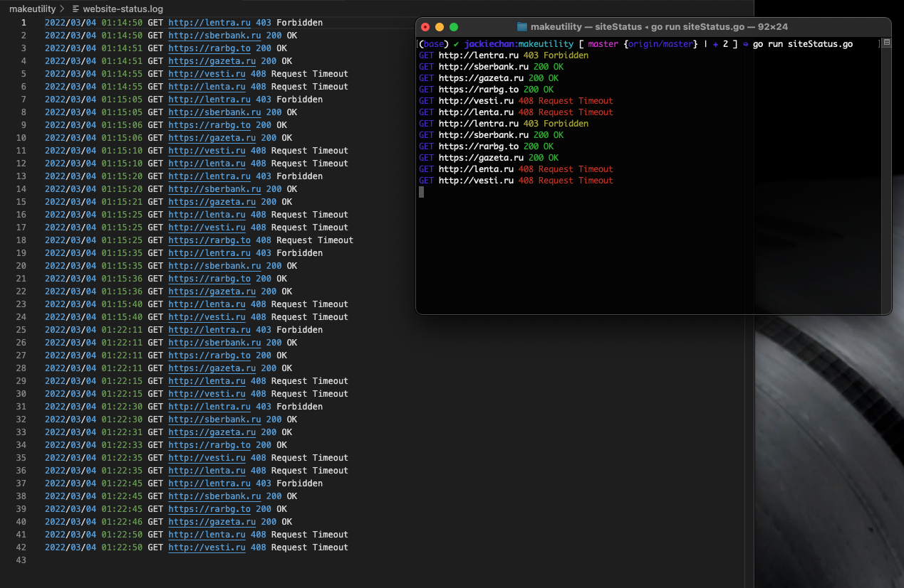

# Status Check

This script checks http status codes of user-defined websites and logs to a txt file and terminal output.

## Installation

1. `go run siteStatus.go`

## Usage

1. Define target urls in `websites.txt`
1. `go run siteStatus.go`
1. Check `website-status.txt` and terminal for live updates. Change `line 73` in `siteStatus.go` to increase or decrease time between pings.
